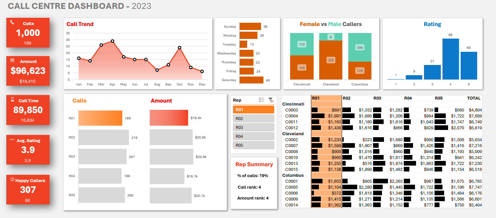

# 📞 Call Centre Dashboard Project

An Excel-based Call Centre Dashboard designed to empower managers and analysts with actionable insights into call center performance, customer satisfaction, and representative effectiveness. This dashboard brings together key metrics to support data-driven decision-making and help optimize call handling and customer interactions.

## 🌟 Project Overview

**Objective:**  
To create a streamlined and interactive dashboard that tracks essential call center metrics, enabling management to monitor performance trends, agent productivity, and customer satisfaction efficiently.

**Data Source:**  
A structured dataset comprising call records, including:
- Call details: Call ID, duration, and call date
- Customer data: Customer ID, demographics, and purchase behavior
- Performance metrics: Satisfaction ratings and representative information

## 📊 Key Features

### 🔑 Metrics & KPIs
- **Total Call Count**: Overall number of calls handled, giving a view of call center workload.
- **Total Call Duration**: Sum of all call durations, providing insights into time allocation.
- **Average Satisfaction Rating**: Aggregate score reflecting customer satisfaction.
- **5-Star Calls**: Count of high-rated calls (5-star), highlighting successful interactions.

### 🛠️ Insights Provided
- **Call Duration Analysis**: Calls segmented by duration, helping to understand average handling times and identify calls that require extended engagement.
- **Customer Satisfaction Trends**: Ratings are averaged and categorized to capture satisfaction trends and highlight areas for improvement.
- **Purchase Behavior**: Links purchase amounts with calls to evaluate revenue potential from customer interactions.

### 📈 Pivot Tables & Interactive Elements
The `Pivots` sheet in the dashboard enables further exploration, allowing users to filter and analyze by:
- **Representative Performance**: Track metrics for individual representatives.
- **Duration Buckets**: Calls categorized by duration for efficiency analysis.
- **Customer Demographics**: Insights on customer engagement based on age, gender, and location.

## 🚀 How to Use the Dashboard

1. **Navigate to the 'Customer Centre Report'** sheet to view the main dashboard.
2. **Explore Interactive Elements**: Use pivot tables and slicers to filter by representative, call duration, satisfaction rating, and customer demographics.
3. **Identify Trends and Patterns**: Analyze call volumes, satisfaction ratings, and customer purchase patterns to make data-backed operational adjustments.

## ⚠️ Challenges & Limitations

- **Data Gaps**: Satisfaction and purchase behavior are recorded only for available data, which may miss some customer sentiments or revenue.
- **Manual Data Validation**: Certain demographic details might require manual entry or verification, depending on data collection practices.

## 👥 Audience

Ideal for call center managers, team leads, and analysts who want to:
- Improve call handling efficiency
- Monitor representative performance
- Boost customer satisfaction
- Drive revenue through optimized call center operations
